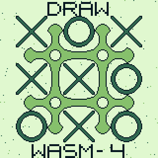

# Tic Tac Toe WASM4-Edition

A simple version of "Tic Tac Toe" (aka "noughts and crosses") using [WASM4](https://github.com/aduros/wasm4) and [Go](https://golang.org).

## Rules

Two player place either a "X" or a "O" on the 3x3 board. The player who gets 3 in a row, wins the game.

## How to play

A blinking "X" or a blinking "O" indicate the current player.
You move it around by using the D-Pad of WASM4.

Making your move (placing the piece) done by pressing "Button 1".

By Pressing "Button 2", the A.I. will make a move instead.
